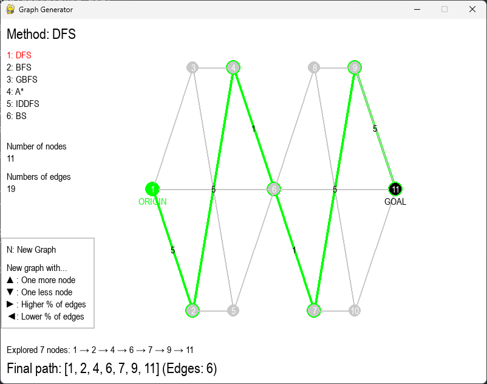

# Map Search With Trained Machine Learning Models - COS30019



This repository contains a tree-search graph generator, using six search algorithms:
- DFS
- BFS
- GBFS
- A*
- Iterative-depth DFS
- Beam Search

# Prerequisites
- Python 3.12.9
- Pygame
- Numpy

# 

# Installation - With Anaconda

```
> conda create -n treeenv python=3.12.9
> conda activate treeenv
> pip install -r requirements.txt
```

# Usage instructions

```
> python generator.py
```
